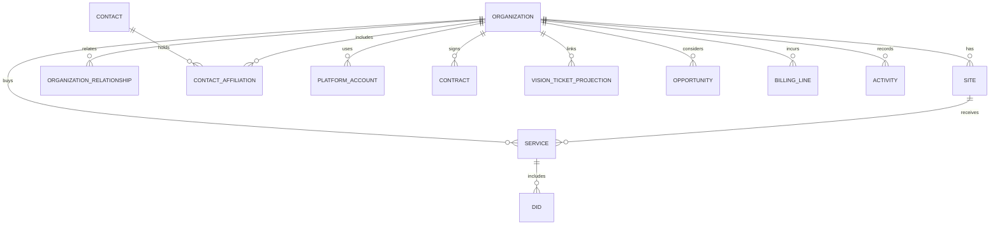

# Heritage CRM Build Specification

**Product name (working):** Heritage CRM  
**Company:** ACL Telecom LLC dba Heritage Telecom  
**Document status:** Implementation baseline v1.0  
**Date:** August 11, 2026  
**Source:** Heritage CRM Requirements & RFP

---

## 1. Executive decision

Build Heritage CRM first as Heritage Telecom's operational system of record, not as an immediate full replacement for every GoHighLevel function.

Phase 1 replaces the parts of the current stack that are weakest for Heritage:

- Customer, site, contact, and telecom-service records
- Contract and renewal management
- Vision ticket links, account-level support history, and support-burden metrics
- SkySwitch billing reconciliation
- Customer health, MRR, and operational dashboards
- Structured activity history and ownership

GoHighLevel remains the marketing and prospect-nurture engine during Phases 1 and 2. It may be retired only after Heritage CRM has proven email authentication, deliverability, campaigns, forms, SMS compliance, and automation in production.

This staged approach avoids tying the operational build to the riskiest and least differentiated portion of a CRM: marketing-email infrastructure.

---

## 2. Product objective

Heritage CRM must give any authorized team member one reliable place to answer:

1. Who is this customer, and which organizations and sites are related?
2. What services, numbers, seats, contracts, and compliance obligations do they have?
3. What do they pay, what do they cost, and does billing match provisioned service?
4. What is open, overdue, broken, or awaiting a decision?
5. What has happened with the account, and who owns the next action?
6. Which customers are at risk, approaching renewal, or positioned for growth?

### Success outcomes

- No renewal or auto-renewal deadline is missed because it lived in someone's head or inbox.
- SkySwitch charges can be reconciled to customer services and invoices without spreadsheet archaeology.
- Account owners can see linked Vision tickets and support burden alongside customer configuration and commercial history.
- Telecom inventory is modeled as structured data, not buried in notes.
- Leadership has trustworthy MRR, churn, renewal, Vision ticket, and account-health reporting.
- Heritage owns and can export all application data and documents.

---

## 3. Users and roles

| Role | Primary needs | Default access |
|---|---|---|
| Administrator | Configuration, integrations, users, imports, audit | Full access |
| Operations leader | Accounts, billing, renewals, escalations, reporting | All business records; limited security configuration |
| Support manager/technician | Account context, services, linked Vision tickets, and tasks | Customer records and Vision ticket summaries; no financial administration |
| Sales/account manager | Leads, opportunities, contacts, activities, proposals, renewals | Sales and assigned account records; financial summary only |
| Billing/admin | Contracts, services, invoices, reconciliation, exports | Customer and financial records; no security administration |
| Read-only/leadership | Dashboards and record inspection | Read-only |

Permissions must support record-level restrictions later, but the MVP may use module-level permissions because Heritage has a small trusted team.

---

## 4. Scope boundaries

### Phase 1: operational MVP

- Authentication, users, roles, and audit log
- Global search and universal activity timeline
- Organizations, sites, contacts, relationships, and ownership
- Telecom account, domain, service, seat, DID summary, and compliance records
- Contracts, renewal alerts, recurring revenue, and service pricing
- Vision ticket integration, account-level ticket summaries, external links, and support metrics
- Internal CRM tasks, notes, and attachments for account-management work only
- Customer email synchronization and account-level communication history
- Structured call notes linked to accounts, contacts, sites, and opportunities
- SkySwitch billing-file import and reconciliation workspace
- Dashboards for renewals, MRR, discrepancies, Vision ticket trends, tasks, and account health
- CSV import/export and documented REST API/webhooks
- One-way or controlled two-way GoHighLevel synchronization for contacts and opportunities

### Phase 2: sales and automation

- Multiple vertical-specific opportunity pipelines
- Seat-based quote and MRR calculator
- Competitor and win/loss tracking
- Relationship-based sales cadences
- Proposal generation or proposal-tool integration
- Customer health scoring and expansion signals
- NetSapiens/SkySwitch event integration where accessible
- Click-to-dial, screen pop, and automated call association
- MaxAI workflow integration

### Phase 3: possible GoHighLevel retirement

- Email campaign builder and authenticated sending
- Merge-token templates and automated sequences
- Forms and landing pages
- 10DLC-compliant two-way SMS tied to approved brands, campaigns, and DIDs
- Consent, opt-in, opt-out, suppression, and quiet-hours enforcement
- Campaign analytics and A/B tests

### Explicitly out of scope for MVP

- Building a PBX or replacing NetSapiens/SkySwitch
- Full accounting/general ledger
- Payroll, HR, project management, or inventory warehousing
- Native payment processing
- Custom email-delivery infrastructure
- Customer self-service portal and public knowledge base
- Native ticket intake, routing, replies, SLA management, technician workflow, or replacement of Vision
- Mobile-native iOS/Android applications; the MVP will be responsive web

---

## 5. Core workflows

### 5.1 New customer onboarding

1. Convert a won opportunity or create a customer directly.
2. Create the parent organization and every operating site.
3. Assign implementation, account, support, and billing owners.
4. Record SkySwitch account/sub-account, NetSapiens domain, service tier, contract, and billing terms.
5. Add contacts with roles such as decision maker, technical, billing, emergency, and site contact.
6. Add ordered services, seat quantities, DIDs, numbers to port, E911 locations, and 10DLC requirements.
7. Generate onboarding tasks from a configurable template.
8. Block onboarding completion until required compliance and service fields pass validation.
9. Publish status changes to the activity timeline and relevant webhook subscribers.

### 5.2 Vision ticket visibility

1. Sync or ingest ticket metadata from Vision using its available API, webhook, scheduled export, or other supported integration method.
2. Match the Vision customer identity to one Heritage CRM organization and, where data permits, a site, contact, service, DID, or domain.
3. Store only the metadata required for account context and reporting, including Vision ticket ID, subject, status, priority, category, requester, assigned technician, created/resolved timestamps, and last-updated time.
4. Display a direct deep link that opens the authoritative ticket in Vision.
5. Show open tickets and recent ticket history on the account workspace without recreating Vision's technician workflow.
6. Calculate account-level ticket volume, open count, aging, repeat issues, and support trend from synchronized metadata.
7. Route unmapped Vision customer identities to an integration-review queue.
8. Never permit CRM edits to ticket content or workflow unless a later, explicitly approved integration requirement defines a safe write-back action.

### 5.3 Renewal management

1. Store effective date, term, renewal date, auto-renewal rule, notice window, and cancellation deadline.
2. Calculate the last safe action date.
3. Create alerts and tasks at configurable intervals, initially 180, 120, 90, 60, and 30 days.
4. Present current MRR, services, linked Vision ticket history, health risks, margin indicators, and expansion opportunities.
5. Record renewal disposition: renewed, expanded, downsized, churned, pending, or month-to-month.
6. Require new dates and terms when marked renewed.

### 5.4 Monthly billing reconciliation

1. Upload a SkySwitch billing CSV/XLSX export.
2. Preserve the original file and import metadata.
3. Map vendor rows to customer, site, domain, service, DID, or other billing identity using saved rules.
4. Compare vendor quantity and cost to active CRM services and expected customer billing.
5. Classify rows as matched, new/unmapped, quantity mismatch, cost change, missing from vendor, missing from CRM, or ignored.
6. Let an authorized user resolve each discrepancy with an explanation and optional service update.
7. Lock the completed reconciliation period while retaining an auditable adjustment process.
8. Export discrepancy and customer-profitability summaries.

### 5.5 Account review

1. Open a single account workspace.
2. See parent/child structure, sites, contacts, services, MRR, estimated direct cost, contracts, compliance, linked Vision tickets, tasks, opportunities, and recent activity.
3. Display risks and required actions before lower-priority history.
4. Record review notes, decisions, next action, owner, and due date.

### 5.6 Customer email synchronization

1. Connect each approved Heritage business mailbox through the provider's supported OAuth/API integration.
2. Ingest sent and received customer emails, including sender, recipients, subject, complete plain-text and/or HTML body, timestamps, message/thread IDs, and attachment metadata with source links.
3. Match participants first to known contact email addresses, then associate the email with that contact's organization and relevant site.
4. If one participant belongs to multiple organizations, or participants imply conflicting accounts, place the message in an association-review queue rather than guessing.
5. Preserve the provider's thread and message IDs so repeated synchronization cannot create duplicates.
6. Allow an authorized user to associate, reassign, or exclude a message and apply that correction to future matching where appropriate.
7. Display synchronized email on the account and contact timelines with direction, participants, subject, date, mailbox, and a link to open the source message when supported.
8. Exclude internal-only email, bulk marketing traffic, automated system mail, spam, and designated private folders or labels unless explicitly included.
9. Respect mailbox permissions. CRM access to a synchronized message must not exceed the permissions approved for that mailbox or user role.

### 5.7 Call notes

1. A user can create a call note from an organization, contact, opportunity, site, or global quick-create action.
2. Every call note must have one canonical organization plus call date/time, direction, participants, author, summary, outcome/disposition, and next action.
3. Optional associations include site, contact, opportunity, service, DID, and Vision ticket link.
4. Saving a next action can create an assigned CRM task with a due date.
5. Call notes appear immediately on all relevant timelines while preserving the canonical account association.
6. Phase 1 supports manual call notes. Phase 2 may prefill call metadata from CTI/call records, but users remain responsible for the substantive note and outcome.

---

## 6. Functional requirements

Requirement IDs are stable references for development and acceptance testing.

### 6.1 Identity, navigation, and administration

| ID | Requirement | Priority |
|---|---|---|
| ADM-01 | Users authenticate through secure email/password or supported SSO, with MFA available and required for administrators. | Must |
| ADM-02 | Administrators can invite, deactivate, and assign roles without deleting historical ownership. | Must |
| ADM-03 | Every create, update, delete, import, export, login, and permission change is auditable by actor and timestamp. | Must |
| ADM-04 | Global search finds organizations, aliases, sites, contacts, phone numbers, DIDs, domains, Vision ticket IDs, and opportunities. | Must |
| ADM-05 | The application is responsive and supports current desktop and mobile browsers. | Must |
| ADM-06 | Users have a personal work queue of overdue and upcoming CRM tasks, renewals, integration exceptions, and assigned billing discrepancies. | Must |

### 6.2 Accounts, sites, and contacts

| ID | Requirement | Priority |
|---|---|---|
| ACC-01 | An organization can have a parent, multiple child organizations, and multiple sites without duplicating the customer record. | Must |
| ACC-02 | Organization types include prospect, customer, former customer, partner, vendor, and related party; multiple roles may apply. | Must |
| ACC-03 | Accounts store legal name, DBA, vertical, lifecycle status, owners, source, billing identity, tax status, addresses, geocode, and tags. | Must |
| ACC-04 | Contacts may belong to multiple organizations/sites with a role and one primary relationship. | Must |
| ACC-05 | Contact roles include decision maker, champion, technical, billing, emergency, site, and former contact. | Must |
| ACC-06 | Duplicate detection checks normalized organization name, domain, email, and telephone number during entry and import. | Must |
| ACC-07 | Related organizations can be linked with a typed relationship and notes. | Should |
| ACC-08 | Records support notes, attachments, tasks, and chronological activity. | Must |

### 6.3 Telecom inventory and compliance

| ID | Requirement | Priority |
|---|---|---|
| TEL-01 | Each customer may have one or more platform accounts storing provider, SkySwitch account ID, sub-account, reseller identity, and NetSapiens domain. | Must |
| TEL-02 | Services are structured records with site, service type, tier, status, activation/termination dates, quantity, unit price, MRR, unit cost, vendor, and vendor SKU. | Must |
| TEL-03 | Service types are configurable and initially include hosted seat, convenience seat, fax, contact center, SMS, RabbitRun, DIA, number/DID, hardware, and other recurring service. | Must |
| TEL-04 | The account stores calculated active seat and DID counts while preserving monthly snapshots for historical reporting. | Must |
| TEL-05 | DIDs may be stored individually or as summarized ranges/counts. Any DID used for SMS, E911, porting, or Vision ticket association must have an individual record. | Must |
| TEL-06 | E911 records track DID, dispatchable location, status, provider reference, last verified date, and exception reason. | Must |
| TEL-07 | 10DLC records track brand, campaign, use case, provider IDs, status, linked DIDs, rejection reason, and renewal/review dates. | Must |
| TEL-08 | Porting projects track numbers, losing carrier, requested/FOC/completion dates, status, rejections, and documents. | Must |
| TEL-09 | Invalid operational states generate exceptions, including active SMS without approved campaign and active DID without required E911 disposition. | Must |
| TEL-10 | Secrets and PBX credentials are never stored in ordinary notes or custom fields. References to an approved secrets manager may be stored. | Must |

### 6.4 Contracts, revenue, and renewals

| ID | Requirement | Priority |
|---|---|---|
| CON-01 | Contracts store type, status, signed/effective/end dates, term, auto-renewal terms, notice days, cancellation deadline, document, and owner. | Must |
| CON-02 | The system calculates renewal and notice dates and creates scheduled alerts/tasks. | Must |
| CON-03 | A contract may cover multiple organizations, sites, and services. | Must |
| CON-04 | MRR is calculated from active recurring service lines, with manual adjustment visible and audited. | Must |
| CON-05 | MRR snapshots preserve period history and distinguish new, expansion, contraction, churn, and reactivation movements. | Must |
| CON-06 | Estimated gross margin uses recurring revenue minus mapped direct vendor cost and clearly labels incomplete cost data. | Should |

### 6.5 Opportunities and sales

| ID | Requirement | Priority |
|---|---|---|
| SAL-01 | Administrators can configure multiple pipelines and stages for healthcare, funeral home, and general SMB motions. | Must in Phase 2 |
| SAL-02 | Opportunities store expected seats, non-seat recurring items, calculated MRR, one-time revenue, probability, close date, owner, and source. | Must in Phase 2 |
| SAL-03 | Opportunities store incumbent competitor, displacement reason, win/loss reason, and vertical. | Should |
| SAL-04 | Stage changes may create configurable tasks and require stage-specific fields. | Must in Phase 2 |
| SAL-05 | A won opportunity can create or update organizations, sites, contacts, contract, services, and onboarding checklist without re-entry. | Must in Phase 2 |

### 6.6 Vision ticket integration and work management

| ID | Requirement | Priority |
|---|---|---|
| SUP-01 | The CRM stores a read-only local projection of required Vision ticket metadata and Vision's immutable external ticket ID. | Must |
| SUP-02 | Every linked ticket displays a direct URL to the authoritative record in Vision. | Must |
| SUP-03 | Vision customer identities map to CRM organizations through a durable, auditable external-ID mapping. | Must |
| SUP-04 | Where reliable identifiers exist, tickets may additionally link to a site, contact, service, DID, or domain. | Should |
| SUP-05 | Ticket synchronization is idempotent and updates the existing projection rather than creating duplicates. | Must |
| SUP-06 | Failed or unmapped records enter a visible review queue with retry and manual-mapping actions. | Must |
| SUP-07 | The account view shows open tickets and recent ticket history but does not reproduce ticket conversations or technician workflow unless Vision requires local caching for integration purposes. | Must |
| SUP-08 | Support metrics include open count, ticket volume by period, age of oldest open ticket, recent categories, and repeat-issue indicators when the source data permits. | Must |
| SUP-09 | The CRM must not accept customer support intake, send ticket replies, change ticket status, assign technicians, or become the SLA system of record. | Must |
| SUP-10 | Internal CRM tasks can relate to any major record, recur, carry priority/owner/due date, and appear in work queues. | Must |

### 6.7 Billing reconciliation

| ID | Requirement | Priority |
|---|---|---|
| BIL-01 | Authorized users can upload CSV/XLSX billing exports with dry-run validation before committing. | Must |
| BIL-02 | Column mappings and normalization rules are versioned by vendor/export format. | Must |
| BIL-03 | Imports are idempotent; re-uploading the same file cannot duplicate costs or usage. | Must |
| BIL-04 | Each source row retains source-file, row, billing period, vendor identifiers, description, quantity, rate, amount, and mapping result. | Must |
| BIL-05 | The system supports exact and rule-based matching, then routes unresolved rows for human mapping. | Must |
| BIL-06 | Reconciliation detects new charges, removed charges, quantity variances, rate/cost changes, and unmapped charges. | Must |
| BIL-07 | Resolution actions are audited and may optionally update the corresponding service record. | Must |
| BIL-08 | Reports show direct cost by customer, service type, and period, including fax origination/usage where present. | Must |
| BIL-09 | Completed periods are locked; adjustments are additive and attributable. | Must |

### 6.8 Activities, communications, and documents

| ID | Requirement | Priority |
|---|---|---|
| ACT-01 | A normalized activity model records calls, emails, meetings, notes, status changes, imports, tasks, and system events. | Must |
| ACT-02 | Activities may be associated with multiple relevant records but have one canonical account context. | Must |
| ACT-03 | Users can pin an important note and mark a note internal/sensitive subject to permission. | Should |
| ACT-04 | Files are stored in object storage with metadata, malware scanning, access controls, and record associations. | Must |
| ACT-05 | Phase 2 CTI supports click-to-dial, inbound lookup/screen-pop, and call disposition/logging through an adapter layer. | Should |
| ACT-06 | Approved business mailboxes synchronize customer email through supported OAuth/API access using provider message and thread IDs. | Must |
| ACT-07 | Email association first uses exact known contact addresses; ambiguous or conflicting matches enter a review queue and are never silently guessed. | Must |
| ACT-08 | Email synchronization is incremental and idempotent and supports retry, backfill, and source-message deep links where available. | Must |
| ACT-09 | Administrators can define exclusions for internal domains, folders/labels, automated senders, bulk mail, spam, and private content. | Must |
| ACT-10 | Authorized users can manually associate, reassign, or exclude an email with an auditable reason. | Must |
| ACT-11 | Call notes require a canonical account, timestamp, direction, participants, author, summary, and outcome/disposition. | Must |
| ACT-12 | Call notes may link to contacts, sites, opportunities, services, DIDs, tasks, and Vision tickets and can generate a follow-up task. | Must |
| ACT-13 | Call-note creation is available from the account workspace and global quick-create interface. | Must |
| ACT-14 | The CRM stores and displays the complete synchronized customer-email body, preserving readable plain text and sanitized HTML while removing unsafe active content. | Must |
| ACT-15 | Email attachments are not copied into CRM storage. The CRM displays attachment filename, type, and size and links back to the canonical mailbox message or provider attachment endpoint subject to source-mailbox permissions. | Must |

### 6.9 Reporting

| ID | Requirement | Priority |
|---|---|---|
| REP-01 | Executive dashboard shows active MRR, MRR movement, renewals, churn, linked Vision ticket trends, billing discrepancies, and overdue CRM work. | Must |
| REP-02 | Renewal dashboard groups contracts by action deadline and owner. | Must |
| REP-03 | Support-context dashboard shows Vision ticket volume, open count, aging, category, repeat issues, and customer based on the metadata Vision makes available. | Must |
| REP-04 | Billing dashboard shows reconciliation status, discrepancies, vendor cost, estimated margin, and unmapped charges. | Must |
| REP-05 | Pipeline reporting supports vertical, stage, owner, source, competitor, expected MRR, and weighted MRR. | Must in Phase 2 |
| REP-06 | Every dashboard metric links to the underlying records and displays its definition. | Must |
| REP-07 | Reports export to CSV with current filters and timezone-aware dates. | Must |

### 6.10 API, webhooks, and data portability

| ID | Requirement | Priority |
|---|---|---|
| API-01 | A versioned REST API supports CRUD and search for all core entities. | Must |
| API-02 | Webhooks publish create/update/delete and key workflow events with signing, retries, delivery logs, and idempotency keys. | Must |
| API-03 | Integration credentials use least privilege and can be rotated/revoked. | Must |
| API-04 | Bulk import provides validation, preview, error rows, rollback for failed batches, and an import audit. | Must |
| API-05 | Full export includes all structured data, activity, audit metadata, and documents in documented formats. | Must |
| API-06 | API rate limits are documented and sufficient for bulk reconciliation and synchronization. | Must |

---

## 7. Data model

Use UUID primary keys, UTC timestamps, soft deletion where recovery is necessary, and explicit tenant/company ownership even if the first release serves only Heritage.

### Core entity relationships

### Entity catalog

| Entity | Important fields |
|---|---|
| Organization | name, legal_name, DBA, parent_id, vertical, lifecycle_status, billing_customer_id, owners, geocode, tags |
| Organization relationship | from_org, to_org, relationship_type, start/end, notes |
| Site | organization_id, name, service/billing/dispatchable addresses, timezone, status, site contact |
| Contact | name, emails, phones, preferred channel, consent flags, status |
| Contact affiliation | contact_id, organization_id, site_id, role, title, primary flag, start/end |
| Platform account | organization_id, provider, reseller/sub-account, provider account ID, NetSapiens domain, status |
| Service | organization_id, site_id, platform_account_id, type, SKU, tier, quantity, price, cost, dates, status |
| DID | E.164 number, organization/site/service, provider, status, SMS status, E911 status, port status |
| E911 registration | DID, dispatchable location, provider ID, status, verified date, exception |
| 10DLC brand/campaign | organization, provider IDs, use case, status, dates, rejection reason |
| Port project/item | project, DID, requested/FOC/completed dates, status, rejection, documents |
| Contract | organization, dates, term, renewal rules, notice deadline, owner, document, status |
| Opportunity | pipeline/stage, account, vertical, expected seats/MRR, competitor, probability, owner |
| Vision ticket projection | Vision ticket ID/URL, account/site/contact/service, subject, priority, status, category, technician, created/resolved/updated timestamps, sync timestamp |
| Task | related entity, title, owner, due date, recurrence, status, priority |
| Activity | type, direction, subject/body, actor, canonical account, occurred_at, external ID |
| Email thread/message | provider mailbox, provider thread/message IDs, participants, subject, complete plain-text/sanitized-HTML body, sent/received time, direction, canonical account, contact/site links, association status, attachment metadata/source links |
| Call note | canonical account, contacts/sites/opportunity/service links, date/time, direction, participants, author, summary, disposition, next action |
| Billing import | provider, period, file hash, mapping version, status, totals, actor |
| Billing line | import, source row, vendor IDs, description, quantity/rate/amount, mapping, result |
| Reconciliation issue | billing line, discrepancy type, expected/actual, owner, resolution, audit |
| MRR snapshot | account, period, starting/ending MRR, movement categories, completeness |
| Attachment | storage key, filename, MIME type, size, checksum, classification, related record |
| Audit event | actor, action, entity, before/after summary, IP/session, timestamp |

### Configurable reference data

- Verticals and subverticals
- Service types, tiers, SKUs, and vendors
- Vision customer/account mapping rules
- Vision status/category normalization rules for CRM reporting
- Pipelines, stages, probabilities, and required fields
- Competitors and win/loss reasons
- Relationship and contact-role types
- Task/onboarding templates
- Renewal alert intervals
- Billing mappings and exception rules
- Email inclusion/exclusion, participant-matching, and association rules
- Call directions, dispositions, and outcomes

Custom fields should be available, but core reporting fields must remain first-class database columns. Do not use a custom-field blob as a substitute for a designed telecom data model.

---

## 8. Screen specification

### 8.1 Home / My Work

- Overdue CRM tasks and integration exceptions
- Items due today and next seven days
- Renewals requiring action
- Open or aging Vision tickets requiring account-level attention
- Assigned reconciliation discrepancies
- Quick-create actions

### 8.2 Account workspace

Header: name, lifecycle, parent, vertical, owner, MRR, estimated cost/margin status, health, next action.

Tabs:

1. Overview: risks, next actions, sites, key contacts, active services, open Vision tickets, contracts
2. Sites
3. Contacts
4. Telecom: platform accounts, domains, services, seats, DIDs, E911, 10DLC, ports
5. Contracts and billing
6. Vision tickets
7. Opportunities
8. Activity and documents

The Activity tab must provide filters for email, call notes, meetings, internal notes, tasks, Vision ticket events, and system activity. Ambiguous email must not appear on an account timeline until reviewed.

### 8.3 Vision ticket panel and integration review

- Read-only linked-ticket views by status, priority, category, customer, technician, created date, and age
- Direct links to open the authoritative ticket in Vision
- Unmapped/failed-sync review queue with mapping, retry, and audit history
- No CRM controls for replying, assigning technicians, changing ticket status, or closing tickets

### 8.4 Billing reconciliation workspace

- Import wizard with mapping validation and dry run
- Period summary and totals
- Exception table with source values beside expected CRM values
- Quick mapping and bulk-resolution actions
- Drilldown to source row and affected service
- Completion checklist and locked-period indicator

### 8.5 Renewal workspace

- Timeline buckets based on action deadline, not merely contract end date
- MRR, contract value, notice requirement, health, support load, and opportunity
- Required owner, next action, and due date

### 8.6 Dashboards

- Executive
- Revenue/MRR
- Renewals
- Vision support context
- Billing/cost/margin
- Sales pipeline in Phase 2

---

## 9. Business rules

1. MRR equals the sum of active recurring service-line extended prices for the selected effective date.
2. Estimated direct cost equals mapped vendor recurring and usage costs. Incomplete mappings must display `Incomplete`, never a misleading zero.
3. Contract action deadline equals the applicable end or renewal date minus required notice days.
4. A customer cannot be marked fully onboarded while required E911, porting, or 10DLC items remain unresolved unless an authorized user records an exception.
5. Deactivating a user reassigns or queues their open work and retains their history.
6. Deleting a customer with financial, service, or linked Vision ticket history is prohibited. Authorized users may archive it.
7. Billing-file duplicates are detected by provider, period, checksum, and external invoice identity.
8. Vision remains authoritative for ticket status, assignment, SLA calculations, replies, and resolution. CRM-derived ticket metrics are informational.
9. All date-driven jobs use the account/site timezone where operationally relevant and America/Detroit as the company default.
10. Financial and service edits effective in a closed historical period require an adjustment record.

---

## 10. Integrations

### Integration architecture

All third-party connections must use adapters behind an internal integration interface. Core business logic must not depend directly on a vendor-specific payload.

| System | Initial direction | Purpose | Phase |
|---|---|---|---|
| GoHighLevel | Controlled two-way | Preserve lead/contact/opportunity and marketing continuity | 1 |
| SkySwitch billing export | File import first; API later if viable | Vendor cost and quantity reconciliation | 1 |
| Business email provider(s) | Read synchronization through OAuth/API | Associate customer correspondence with contacts and accounts | 1 |
| Vision | Read-only into CRM initially | Link tickets to accounts and calculate support-context metrics | 1 |
| NetSapiens/SkySwitch | API/webhook where available | Account/service events, CTI, call association | 2 |
| MaxAI | API/webhook | Technician workflow context without moving ticket ownership into CRM | 2 |
| Proposal/e-sign tool | Two-way | Quote/proposal generation and signed contract return | 2 |
| SMS provider/UCaaS messaging | Two-way | Registered customer messaging and logging | 3 |

### GoHighLevel source-of-truth rules during coexistence

- Heritage CRM owns customer accounts, sites, telecom inventory, contracts, billing, health, renewals, and internal account-management tasks.
- Vision owns support intake, ticket content, technician assignment, ticket status, SLA, replies, attachments, and resolution history.
- The business email provider owns the canonical mailbox message. Heritage CRM owns its account association, exclusions, and timeline projection.
- GoHighLevel owns campaign membership, marketing workflow state, landing-page submissions, and email/SMS campaign events.
- A contact has a cross-system external ID map.
- Field ownership is explicit. Conflicting updates are logged, not silently overwritten.
- Sync uses idempotency keys, a retry queue, and a dead-letter review screen.

---

## 11. Nonfunctional requirements

### Security and privacy

- TLS in transit and managed encryption at rest
- MFA for administrators and recommended for all users
- Role-based authorization enforced server-side
- Secure secrets manager for credentials and API keys
- OWASP Top 10 controls, dependency scanning, and routine patching
- Malware scanning for uploaded files
- Redaction of secrets and sensitive content from logs
- Mailbox scopes limited to the minimum approved permissions, with per-mailbox connection status and revocation
- Configurable handling for sensitive, privileged, internal-only, or private-folder email
- Sanitization of synchronized HTML email and blocking of scripts, tracking execution, remote active content, and unsafe embedded elements
- Attachment access delegated to the source mailbox; CRM must not cache attachment bytes or bypass provider permissions
- Documented incident-response and account-recovery process
- Configurable retention for communication content and audit logs

### Reliability and recovery

- Target availability: 99.9% monthly, excluding scheduled maintenance
- Automated database backups with point-in-time recovery
- Initial targets: RPO 24 hours maximum, RTO 8 hours maximum; improve before broader external access
- Background jobs are retryable and idempotent
- Integration failures are visible in an operations queue
- Restore procedure tested at least quarterly

### Performance

- Standard record views: p95 under 2 seconds at Heritage scale
- Global search: p95 under 2 seconds for indexed records
- List filtering/sorting: p95 under 3 seconds
- Long-running imports and exports execute asynchronously with progress and completion notice

### Accessibility and usability

- Target WCAG 2.1 AA for core workflows
- Keyboard-operable forms and queues
- Plain-language labels and actionable validation messages
- Destructive actions require confirmation and explain impact

### Data ownership

- Full export without vendor assistance in CSV/JSON plus original documents
- No proprietary encryption or format that prevents exit
- Export includes relationships, IDs, timestamps, users, activities, and audit metadata

---

## 12. Recommended technical architecture

The product is small-team operational software. Favor a maintainable modular monolith over microservices.

### Suggested stack

- Frontend: TypeScript with a server-rendered React framework
- Backend: TypeScript service layer and versioned REST API
- Database: managed PostgreSQL
- Queue/jobs: managed Redis-compatible queue or database-backed job runner
- Files: S3-compatible object storage
- Search: PostgreSQL full-text/trigram initially; dedicated search only if needed
- Authentication: managed identity provider or proven authentication library with MFA
- Observability: structured logs, error tracking, uptime checks, and job/integration dashboards
- Hosting: managed platform with separate development, staging, and production environments

### Design principles

- One deployable application with clear modules and service boundaries
- Database migrations checked into source control
- API-first domain logic shared by UI and integrations
- Configuration over customer-specific code where future change is predictable
- Feature flags for unfinished integrations
- No vendor lock-in around core data or documents

---

## 13. Migration plan

### Required source inventory

- GoHighLevel contacts, companies, opportunities, pipelines, stages, tags, custom fields, notes, tasks, conversations, templates, workflows, forms, and consent data
- Approved business mailboxes, inclusion/exclusion policy, and the historical email backfill period
- Current customer/account spreadsheets
- SkySwitch account and billing exports
- Contract/MSA documents and renewal dates
- Vision customer identities, ticket metadata, link format, integration capability, and available historical records
- Existing build documents and telecom configuration records

### Migration sequence

1. Profile all source data and approve field mappings.
2. Establish canonical organization, site, contact, domain, and telephone normalization rules.
3. Run a dry import and produce counts, duplicates, rejected rows, and unresolved relationships.
4. Clean and approve exceptions.
5. Import organizations, sites, contacts, platform accounts, services, contracts, activities, and opportunities in dependency order; then map Vision identities and approved mailbox participants before synchronizing ticket and email projections.
6. Reconcile record counts and sampled records against source.
7. Run coexistence sync and parallel operational testing.
8. Freeze affected source fields, execute final delta migration, and cut over.
9. Retain read-only source access through the agreed validation period.

### Migration acceptance thresholds

- 100% of active customer organizations imported or explicitly excepted
- 100% of active contracts with known dates imported or flagged for remediation
- 100% of active SkySwitch accounts mapped to a CRM organization
- At least 99.5% of valid contacts imported
- Zero silent data loss; every rejected record appears in an exception report
- Totals for active customers, seats, DIDs, and MRR reconcile to approved baselines

---

## 14. Delivery plan and gates

Durations are planning ranges, not vendor commitments.

| Stage | Deliverable | Exit gate | Indicative duration |
|---|---|---|---|
| 0. Discovery | Data samples, field dictionary, workflow decisions, prototypes | Product owner signs scope and definitions | 2–3 weeks |
| 1. Foundation | Auth, roles, audit, navigation, accounts/sites/contacts | Core records and permissions pass UAT | 3–5 weeks |
| 2. Telecom + contracts | Platform accounts, services, compliance, contracts, renewals | Representative customers fully modeled | 4–6 weeks |
| 3. Vision integration | External-ID mapping, read-only ticket sync, account links, metrics, exception review | Representative Vision tickets link correctly and CRM cannot alter Vision workflow | 2–4 weeks |
| 4. Billing + reporting | Import, mapping, reconciliation, dashboards, exports | One historical and one current period reconcile | 4–6 weeks |
| 5. Migration + pilot | GHL sync, production migration, training, pilot | Data acceptance and pilot signoff | 3–5 weeks |
| 6. Stabilization | Defects, performance, recovery test, documentation | Production acceptance | 2–4 weeks |

Expected Phase 1 range: approximately 20–33 weeks for a disciplined small team. Cutting the schedule should cut scope, not testing, migration, or auditability.

---

## 15. MVP acceptance scenarios

The MVP is not accepted until these scenarios pass in staging using representative Heritage data.

1. Create a parent healthcare organization with three sites, shared and site-specific contacts, separate NetSapiens domains, services, and one master contract.
2. Find that account using legal name, DBA, contact email, domain, and DID.
3. Add recurring seat and fax services and verify calculated seat count and MRR.
4. Configure a contract with auto-renewal and confirm the correct cancellation deadline and alerts.
5. Synchronize open and closed Vision tickets, map them to the correct account, open the source ticket through its deep link, and verify that the CRM cannot alter Vision workflow.
6. Synchronize an inbound and outbound customer email thread, associate it through an exact contact match, and verify the complete readable message bodies appear once on the correct account and contact timelines with unsafe HTML removed; confirm attachment metadata links to the source mailbox without copying attachment bytes.
7. Synchronize an email with an ambiguous multi-account participant, verify it enters review without appearing on either account, then manually associate it and retain the audit trail.
8. Exclude internal, bulk, spam, automated, and private-folder messages according to configured rules.
9. Enter a call note against an account and contact, record disposition and next action, create a follow-up task, and verify all related timelines.
10. Upload a known SkySwitch billing file twice and verify no duplicate financial records.
11. Detect and resolve an unmapped charge, changed seat quantity, fax usage cost, and CRM service missing from the vendor file, retaining audit history.
12. Deactivate a user and verify open work is reassigned without altering historical attribution.
13. Export one complete account and then the complete database, including relationships, synchronized email projections, call notes, and documents.
14. Force failed GHL, Vision, and email synchronizations and verify retry, error visibility, and no duplicate records.
15. Restore the database in a recovery test and document achieved RPO/RTO.

---

## 16. Definition of done

A feature is done only when:

- Acceptance criteria pass
- Authorization is enforced and tested
- Audit events are recorded where required
- Empty, loading, validation, failure, and retry states are implemented
- API and field documentation are updated
- Automated tests cover business-critical rules
- Monitoring and error visibility exist
- Migration/import behavior is defined
- Product owner completes UAT in staging

---

## 17. Decisions required before development

These decisions materially change schema or integration work and should be resolved during Stage 0:

1. What is the authoritative source for customer invoice amounts and line items?
2. Which exact SkySwitch billing exports are used, and can representative files from multiple months be supplied?
3. Will the MVP store every DID, or only compliance/porting/SMS DIDs plus summarized counts for the rest?
4. What integration methods, fields, customer identifiers, deep-link patterns, historical access, and rate limits does Vision expose?
5. Which business mailboxes and providers will sync, how much history should be backfilled, and which folders, labels, senders, or message types must be excluded?
6. What data may be pulled from NetSapiens/SkySwitch APIs under Heritage's current access?
7. Which GoHighLevel objects must remain synchronized during coexistence, and which system owns each shared field?
8. Where are signed MSAs and customer build documents stored today, and should the CRM copy them or link to them?
9. Which roles may see cost, margin, contracts, synchronized email, call recordings, and sensitive notes?
10. Is customer profitability defined as recurring gross margin only, or should support labor be included?
11. What exact conditions define an active customer, churn, seat, MRR, and renewal for reporting?

Until these are answered, use the assumptions in this specification and do not hard-code uncertain workflow details.

---

## 18. Product owner priorities

When scope conflicts arise, use this order:

1. Correct customer and telecom data
2. Renewal and compliance risk prevention
3. Vision ticket visibility and account-level support burden
4. Billing reconciliation and trustworthy revenue/cost reporting
5. Usability for the small Heritage team
6. Integration reliability and data portability
7. Sales workflow
8. Marketing replacement

The central constraint is not feature count. It is operational trust. Heritage CRM succeeds when the team relies on it daily because the data is current, the next action is obvious, and discrepancies cannot quietly disappear.
